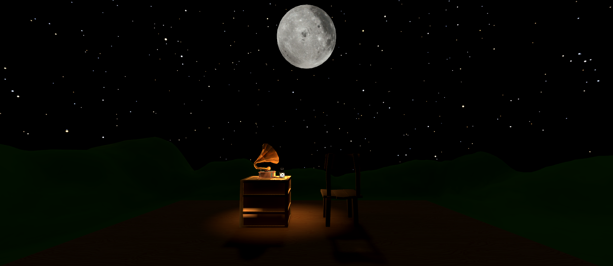

# Moonlit-Woods
Swansea University M.Sc. Virtual Reality

This is a simple virtual environment that uses Audio Sources and Particle Systems to create an immersive area in a forest. It was developed in Unity version 2022.3.10f1 and tested on a Meta Quest 2 as part of an assignment.

## Installation guide
In the releases section, download the latest version (.zip) of the build and extract the file. To run the application, run Moon View.exe
## Other Platforms
Spatial: [Moonlit Woods](www.spatial.io/s/Moonlit-Woods-6528181128d9069eddc3f8ac?share=1667209296106747121)

## Credits
October 2023

Virtual Worlds

Made in Unity 2022.3.10f1

**Assets used:**

Trees, branches and vegetation: Low-Poly Simple Nature Pack

Water Shader: Oasis Water Package

Gramophone model: Don Carson

Stars Skybox: Real Stars Skybox Lite

Campfire and Chair: Low Poly: Woods Lifestyle

Lamp and Box: Low Poly Christmas Pack Free

Wood Texture: [iStock](www.istockphoto.com/vector/wood-textured-background-with-lines-gm469806788-62116780)

Moon Texture: [NASA](svs.gsfc.nasa.gov/cgi-bin/details.cgi?aid=4720)

Campfire Sound Effect: [fireplace-sound](opengameart.org/content/fireplace-sound-loop) 

Gramophone song: Fly Me to the Moon - Frank Sinatra
